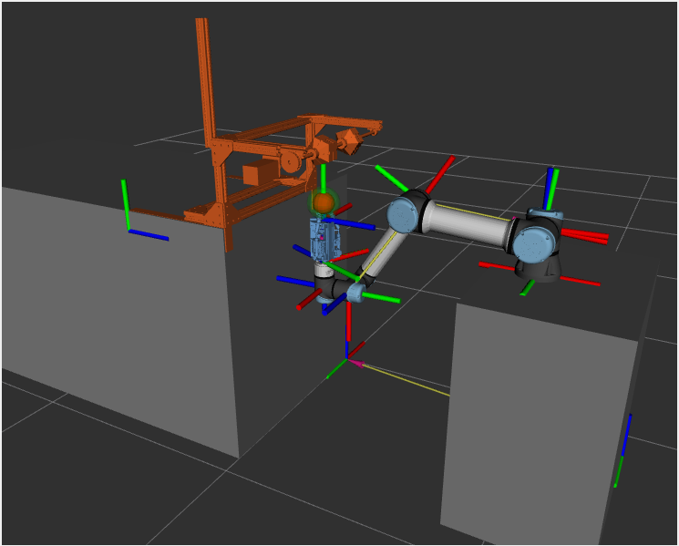

# Apple Gripper
### Repository for the ROS2 conversion of Alejo Velasquez's ROS1 framework

This repository contains scripts to use Alejo's custom suction gripper and a UR5e to run proxy apple picking tests. It moves across N sampled "roll" points around the circumference of the apple to test different variables on pick success.

  

This repository has currently been tested only with UR-provided fake UR5e hardware. Creating a full simulation world was out of scope of this conversion, as was setting up real robot hardware. More information about those options can be found in the [UR ROS2 driver documentation](https://docs.ros.org/en/ros2_packages/rolling/api/ur_robot_driver/index.html).

## Packages in the Repository:

- `gripper` - 
- `gripper_msgs` - 

## Requirements:

- [ROS2 Humble](https://docs.ros.org/en/humble/Installation/Ubuntu-Install-Debians.html), full desktop install preferred

- The [UR ROS2 driver](https://github.com/UniversalRobots/Universal_Robots_ROS2_Driver/tree/humble) (includes [MoveIt!](https://moveit.ros.org) support)

        sudo apt install ros-${ROS_DISTRO}-ur

- The [ROS2 joint state publisher](https://index.ros.org/p/joint_state_publisher/#humble)

        sudo apt install ros-humble-joint-state-publisher ros-humble-joint-state-publisher-gui

- [Pyserial](https://pyserial.readthedocs.io)

        pip install pyserial

## Installation:

Make a ROS workspace

    mkdir ros_ws/src && cd src

Clone this repository

    git clone git@github.com:ali-clara/apple_gripper.git

Install all dependencies with [rosdep](https://docs.ros.org/en/humble/Tutorials/Intermediate/Rosdep.html)

    rosdep install --from-paths src -y --ignore-src

Build

    cd ~/ros_ws
    colcon build --symlink-install

## Running

Launch the UR robot driver with fake hardware:

    ros2 launch ur_robot_driver ur_control.launch.py ur_type:=ur5e robot_ip:=yyy.yyy.yyy.yyy use_fake_hardware:=true launch_rviz:=false

Launch the RVIZ world, start MoveIt2 arm control, and connect to the gripper - required before running the pick sequence:

    ros2 launch gripper suction_gripper_launch.py

Run the user interface and start the pick sequence:

    ros2 run gripper user --ros-args --params-file config/apple_proxy_parameters.yaml

