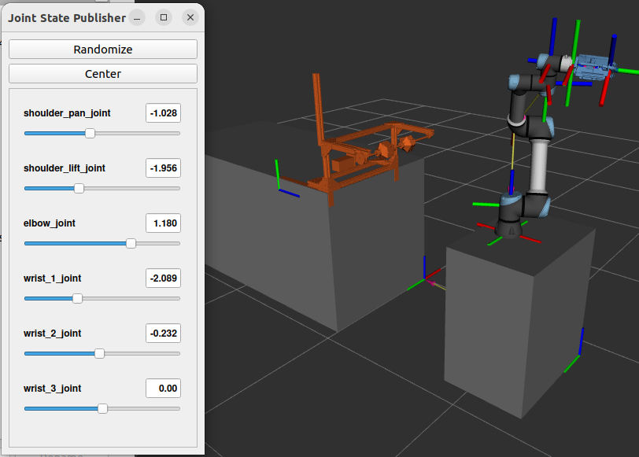

# Apple Picking Experiements with Apple Proxy & Custom Gripper

This is a repository for the ROS2 conversion of Alejo Velasquez's ROS1 apple proxy & gripper framework. The original source code can be found at [github.com/velasale/suction-gripper](https://github.com/velasale/suction-gripper) and is listed under the MIT license.

This repository contains scripts to use Alejo's custom gripper and a UR5e to run proxy apple picking tests. It uses MoveIt2 to move a UR5e end effector to sampled points around the circumference of the apple proxy and attempts a number of picks at each one. This allows us to test the effect of different variables on pick success.

  

## Packages in the Repository:

- `gripper` - 
- `gripper_msgs` - 

## Getting Started:

### Dependencies

- [ROS2 Humble](https://docs.ros.org/en/humble/Installation/Ubuntu-Install-Debians.html), full desktop install preferred

- The [UR ROS2 driver](https://github.com/UniversalRobots/Universal_Robots_ROS2_Driver/tree/humble) (includes [MoveIt!](https://moveit.ros.org) support)

        sudo apt install ros-${ROS_DISTRO}-ur

- The [ROS2 joint state publisher](https://index.ros.org/p/joint_state_publisher/#humble)

        sudo apt install ros-humble-joint-state-publisher ros-humble-joint-state-publisher-gui

- [Pyserial](https://pyserial.readthedocs.io)

        pip install pyserial

- [Arduino IDE](https://docs.arduino.cc/software/ide-v2/tutorials/getting-started/ide-v2-downloading-and-installing/)

### Hardware

- UR5e
    - This repository has currently been tested only with **fake UR5e hardware** provided by the UR ROS2 driver. Creating a full simulation world was out of scope of this conversion, as was setting up real robot hardware.
    - More information about building a simulation or connecting to a real robot can be found in the [UR ROS2 driver documentation](https://docs.ros.org/en/ros2_packages/rolling/api/ur_robot_driver/index.html).

- Alejo's gripper (optional)

    - A custom-built gripper tailored for picking apples. It uses suction cups and extendable fingers to grasp and pick and is controlled with an Arduino Zero.

- An Arduino of your choice (optional)

    - If connected to an Arduino, the system mimics Alejo's gripper by writing and reading "vacuum" and "finger" status to the serial monitor. This framework allows the current system to be easily expanded to use the real gripper. If an Arduino is not connected, the `suction_gripper` node logs the set status but doesn't send Pyserial commands.

### Installation:

Make a ROS2 workspace

    mkdir ros_ws/src && cd src

Clone this repository

    git clone git@github.com:ali-clara/apple_gripper.git

Install dependencies with [rosdep](https://docs.ros.org/en/humble/Tutorials/Intermediate/Rosdep.html)

    cd ~/ros_ws
    rosdep install --from-paths src -y --ignore-src

Build the workspace

    colcon build --symlink-install

## Testing

After installation, the following commands can test the functionality of different components.

### RVIZ world & joint state publisher

To ensure the RVIZ world loads correctly and the joint state publisher controls the UR5e joints, run:

    ros2 launch gripper ur5e_launch.py

This loads the following scene, showing the UR5e and apple proxy with the TF tree. It also runs the joint state publisher GUI, which controls the UR5e joint positions.

  

### Suction gripper Pyserial interface (optional)

The `suction_gripper` node communicates with an Arduino through Pyserial to control the gripper vacuum and fingers. When it recieves a service call, it sends an integer between 1-4 corresponding to vacuum on/off and fingers engaged/disengaged. Currently, the Arduino script just contains a dummy framework that can be easily expanded for full gripper control and functionality.

Connect to an Arduino of your choice, and upload `pyserial_test.ino` from the *gripper/arduino* directory using the ArduinoIDE. Ensure the **baud rate** and **port** match the baud and port set in `suction_gripper.py`. This demo is using an Ardunio UNO with a baud rate of 115200 on port /dev/ttyACM0.

To see the Arduino response to a serial command, open the serial monitor and type `<1>`. If everything is set up correctly, the serial monitor will return `Arduino: turning vacuum on`. Once Arduino functionlity is verified, close the IDE.

In one shell, start the suction gripper node:

    ros2 run gripper suction_gripper.py

In a second shell, call the gripper vacuum or fingers service, e.g:

    ros2 service call /set_vacuum_status gripper_msgs/srv/GripperVacuum "{set_vacuum: True}"

The first shell will log the same serial output as the test with the Arduino IDE.

## Running the Proxy Pick sequence

Launch the UR robot driver with fake hardware:

    ros2 launch ur_robot_driver ur_control.launch.py ur_type:=ur5e robot_ip:=yyy.yyy.yyy.yyy use_fake_hardware:=true launch_rviz:=false

Launch the RVIZ world, start MoveIt2 arm control, and connect to the gripper:

    ros2 launch gripper suction_gripper_launch.py

Finally, run the user interface and start the pick sequence - **must be run from the `gripper` package directory**:

    ros2 run gripper user.py --ros-args --params-file config/apple_proxy_parameters.yaml

The `user` node first prompts the user for inputs about the current experiment setup. It then asks to start the proxy pick sequence, which runs through a set number of trials at specified locations. Upon completion, it saves metadata about the trial.

